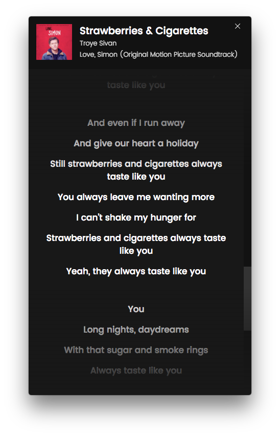
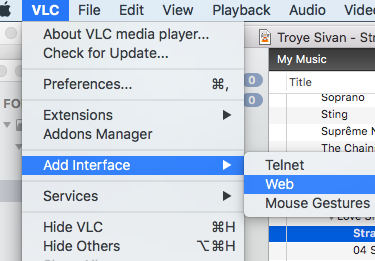

# vlc-lyrics

Shows lyrics from the song you're currently playing in VLC. [Download the latest release.](https://github.com/zerdnem/vlc-lyrics/releases)

## Features

- Lyrics autoscroll
- Automatically get lyrics from musixmatch
- Always on top window if needed
- Typography prettifier

## Building

Enable VLC's Web Interface

Building vlc-lyrics requires [Node.js 6 or later](https://nodejs.org/en/download/) and npm. First, clone this repository:

~~~
$ git clone https://github.com/zerdnem/vlc-lyrics
$ cd vlc-lyrics
~~~

Install the dependencies using npm:

~~~
$ npm install
~~~

You can build using:

~~~
$ npm run build
~~~

The binaries will be created in `vlc-lyrics/dist/`. This app is optimized for Windows, but it should work on other platforms as well.

## Credits

https://github.com/yishn/spotify-lyrics
